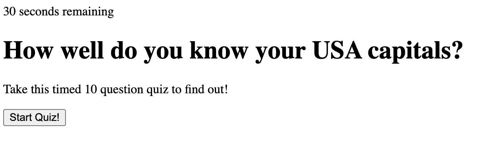
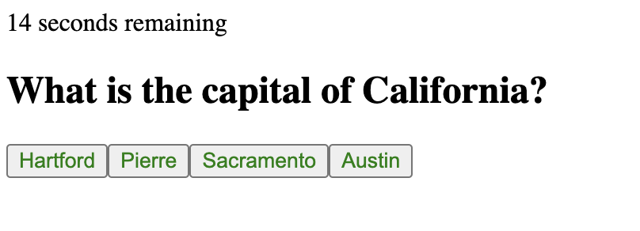
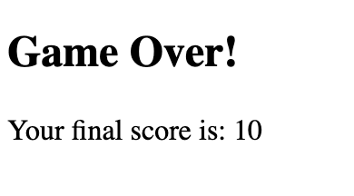

# web-APIs-code-quiz
## Description
- The purpose of this quiz is to test the user on how well they know 10 USA capitals. When they start the quiz, the start screen disppears and the game begins. The button also trggers the timer to start counting down. When the user answers a question, the next question will appear. If the user answers the question wrong then 5 seconds will be taken off of the timer. When all the questions have been cycled through or the timer reaches 0, the game ends and the user is asked for their initials. The end page tells the user their final score.

## Still need to figure out

- Still working on how to create a scoreboard that holds the information from every game and is displayed to the user on the end screen

## Game Images

## Game Link
	[USA capitals Quiz](https://kamarygillespie4.github.io/web-APIs-quiz/)
