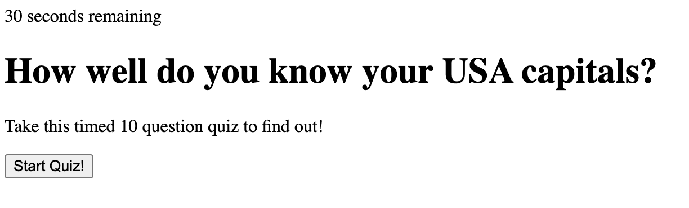
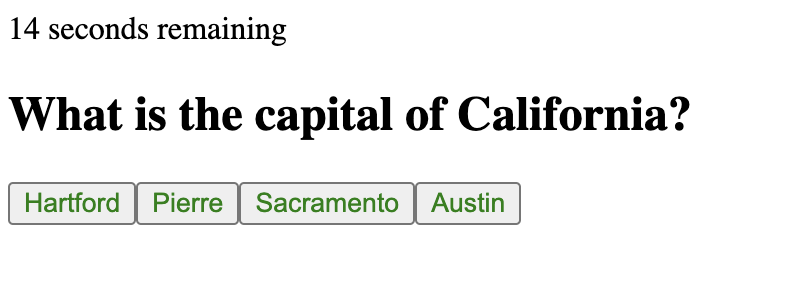
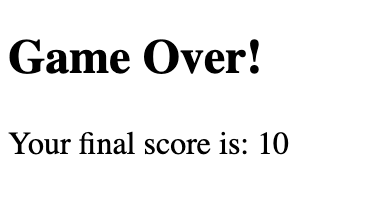

# web-APIs-code-quiz
## Description
- The purpose of this quiz is to test the user on how well they know 10 USA capitals. When they start the quiz, the start screen disppears and the game begins. The button also trggers the timer to start counting down. When the user answers a question, the next question will appear. If the user answers the question wrong then 5 seconds will be taken off of the timer. When all the questions have been cycled through or the timer reaches 0, the game ends and the user is asked for their initials. The end page tells the user their final score.

### Still need to figure out

- Still working on how to create a scoreboard that holds the information from every game and is displayed to the user on the end screen
- Have been focused on functionality but planning on styling the page too so it is visually appealing to the user.

### Game Images

### Game Link
[USA capitals Quiz](https://kamarygillespie4.github.io/web-APIs-quiz/)

## Table of Contents

 [Technologies Used](#technologies)
 [Installation Instructions](#installation)
 [Usage Information](#usage)
 [Contribution Guidelines](#contribution)
 [Testing](#testing)
 [License information](#Licensing)
[Questions](#questions)

## Technologies

This application uses javascript, HTML, and CSS.

## Installation

This application requires no installation.

## Usage

To use this application, open the webpage in your browser. From here, you can start the quiz and play the game.

## Contribution

There were no other contributions to this application.

## Testing

This application has no testing.

## Licensing

This application has no license.

## Questions

If you have any further questions,

- You can email me at: kami.gillespie@gmail.com
- You can find my GitHub at: [kamarygillespie4](https://github.com/kamarygillespie4)
